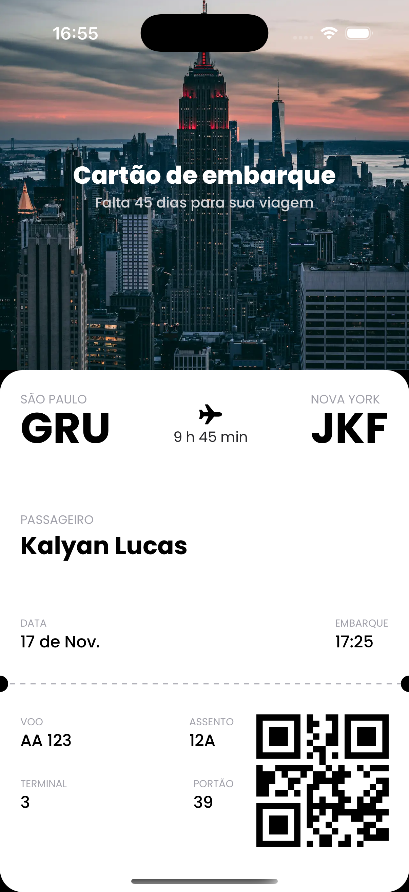

# ✈️ Boarding Pass App

A simple mobile application that generates a digital boarding pass with flight details and a QR code.



## 📱 Features

- 🖋️ Uses **Poppins** font for a modern and clean design.
- 📷 Displays flight details, including departure, destination, and boarding time.
- 🔗 Generates a **QR Code** for easy access at the airport.
- 🎨 Smooth and elegant UI built with **React Native** and **Expo**.

## 🚀 Technologies Used

- **React Native 0.76.7**
- **Expo 52.0.37**
- **@expo-google-fonts/poppins** (for custom typography)
- **react-native-qrcode-svg** (for QR code generation)
- **react-native-svg** (for vector graphics)

## 📦 Installation

1. Clone the repository:
   ```sh
   git clone https://github.com/kalyanbasso/boardingPass.git
   cd boardingPass
   ```
2. Install dependencies:
   ```sh
   npm install
   ```
3. Start the Expo server:
   ```sh
   expo start
   ```
4. Open the Expo Go app on your phone and scan the QR code to run the app.
